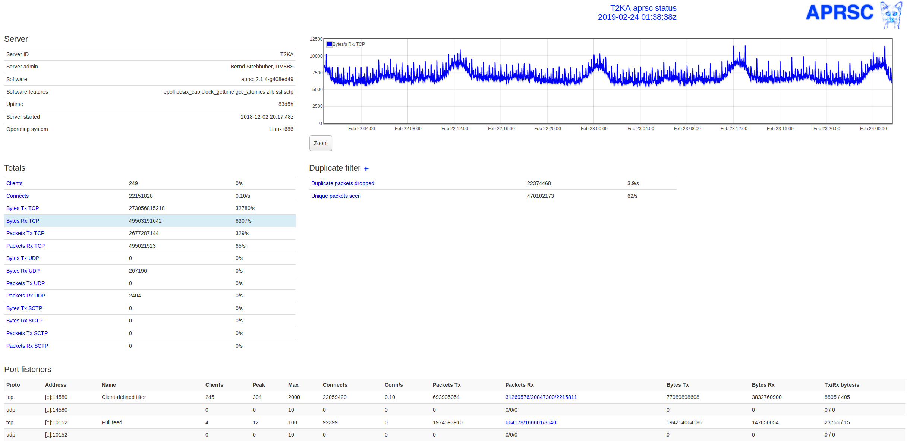

# APRSC Docker

A dockerized version of [hessu's aprsc](http://aprs-is.net/) APRS-IS server. [APRS-IS](http://aprs-is.net/) connects regional APRS packet radio networks together through the Internet. The original source for `aprsc` lives [here](https://github.com/hessu/aprsc).



## Install
[Docker and Docker Compose need to be installed.](https://docs.docker.com/engine/install/debian/)
```bash
# clone the repo
git clone https://github.com/brannondorsey/aprsc-docker
cd aprsc-docker
```

Edit docker-compose.yaml set at least:

```yaml
    environment:
      - APRSC_SERVER_ID=MYCALL
      - APRSC_PASSCODE=MYAPRSCODE
      - APRSC_UPLINK_ENABLED=yes
      - APRSC_MY_ADMIN=My Name, My Call
```

```bash
# run the service in "detach" mode
docker compose up -d

# follow the logs
docker compose logs -f
```

You should now have an HTTP status server running at <http://localhost:14501>.

```bash
# shutdown
docker compose down
```
